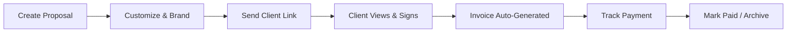
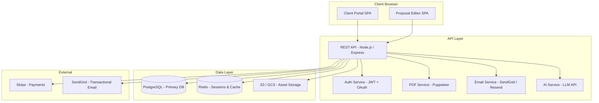
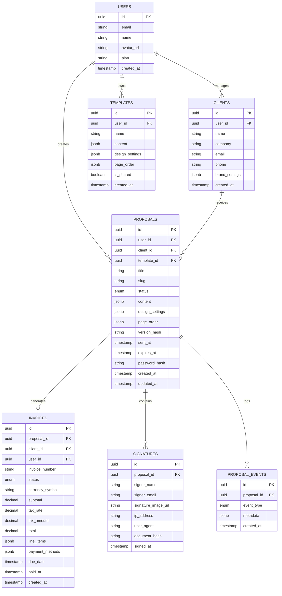
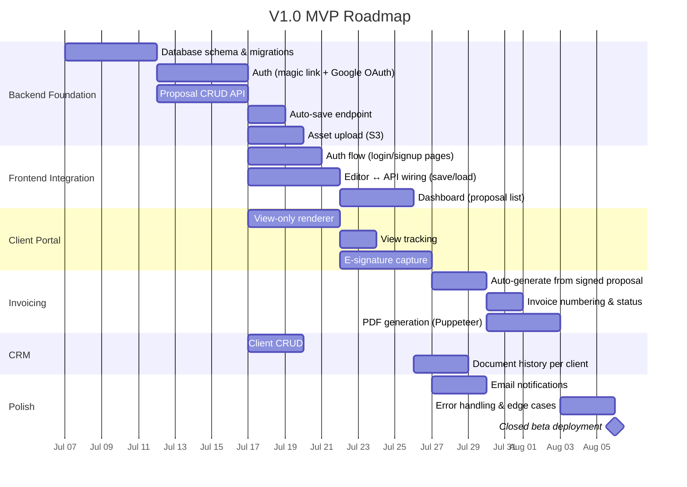

# Proposal Studio — Product Requirements Document (PRD)

**Version:** 1.0  
**Author:** Product Management  
**Last Updated:** July 2, 2026  
**Status:** Draft — Pending Engineering & Stakeholder Review

---

## 1. Problem Statement

Solo developers, freelance designers, and small agencies (especially in Shopify/ecommerce) currently cobble together proposals using a mix of Google Docs, Word, Canva, manual HTML builds, and scattered invoice tools. This creates three pain points that directly hurt revenue:

1. **Time leak.** A typical freelancer spends 2–4 hours per proposal — formatting, duplicating templates, adjusting brand colors. That's unbillable time.
2. **No client accountability trail.** Proposals are sent as email attachments. There's no read receipt, no signature capture, no single link a client can return to. Disputes about "I never agreed to that scope" are common.
3. **Disconnected invoicing.** After a proposal is accepted (verbally, via email, or not at all), the freelancer manually re-enters line items into a separate invoicing tool. Line items drift, totals mismatch, and payment follow-up is manual.

### What We're Not Solving (V1)

- Full project management (we're not Asana)
- Complex accounting/tax compliance (we're not QuickBooks)
- Design-heavy pitch decks (we're not Pitch or Figma)

Proposal Studio sits in the gap between "I need to close a deal" and "I need to get paid." One tool, one flow, zero context-switching.

---

## 2. Target Users

### Primary Persona — "The Solo Operator"

**Name:** Ameer, freelance Shopify developer  
**Team size:** 1  
**Revenue:** $8K–$25K/mo  
**Current stack:** Custom HTML proposals, PayPal invoices, WhatsApp for client comms  

**Jobs to be done:**
- Send a polished, branded proposal to a new lead within 30 minutes of a discovery call
- Get a legally-defensible signature on scope before writing any code
- Auto-generate an invoice the moment the client signs, without re-entering line items
- Know at a glance which proposals are pending, signed, or paid

### Secondary Persona — "The Agency Lead"

**Name:** Sarah, owner of a 4-person Shopify agency  
**Team size:** 4  
**Revenue:** $40K–$100K/mo  
**Current stack:** PandaDoc (too expensive), Google Docs, FreshBooks  

**Jobs to be done:**
- Maintain a shared template library her team can customize per client
- Review proposals before they go out
- Track pipeline by client across all team members
- Consolidated invoicing and payment status

> [!NOTE]
> Sarah's needs drive V2 (multi-user, shared templates, team permissions). V1 is designed entirely around Ameer.

---

## 3. Core User Flow

### Detailed Flow

1. **Create** — User starts from a blank template, a saved template, or an AI-generated draft. Selects client from CRM or creates a new client record.
2. **Customize** — Multi-page editor with live preview. Pages: Cover, Welcome/Intro, Scope of Work, Additional Services, Website Guide, Client Agreement, Invoice, Thank You. User adjusts design settings (fonts, colors, logo) per-client or per-proposal.
3. **Send** — Generates a unique, shareable link. Client receives an email (or manual share via link) with a branded view-only portal.
4. **Sign** — Client reviews the proposal in the portal. Draws or types an e-signature on the Agreement page. Timestamp and IP are captured.
5. **Invoice** — Upon signature, an invoice is auto-generated from the Scope/Services line items. Currency, tax rate, payment methods, and bank details carry over from the proposal.
6. **Track** — Dashboard shows proposal status (Draft → Sent → Viewed → Signed → Invoiced → Paid). Payment status is manually updated (V1) or auto-updated via payment gateway webhook (V2+).

---

## 4. V1 Feature Specification

### 4.1 Multi-Page Proposal Builder

#### What Already Exists (Client-Side Prototype)
The current [index.html](file:///c:/Users/ameer/Desktop/client-proposal/index.html) + [app.js](file:///c:/Users/ameer/Desktop/client-proposal/app.js) prototype already implements:
- 8 content pages with inline `contenteditable` editing
- Drag-and-drop page reordering via a Page Manager panel
- Page show/hide toggles
- Dynamic row add/remove for Scope, Services, Invoice, Welcome, and Guide sections
- Real-time invoice totals with configurable currency and tax
- Dynamic payment methods (add/remove/edit bank name and details)
- JSON export/import for full state serialization
- Print-optimized CSS for PDF generation via `window.print()`

#### What Needs to Be Built (Backend-Powered)

| Capability | Description | Priority |
|---|---|---|
| **Proposal CRUD API** | REST endpoints: `POST /proposals`, `GET /proposals/:id`, `PUT /proposals/:id`, `DELETE /proposals/:id`. Payload = the JSON blob from `gatherData()`. | P0 |
| **Template System** | Save any proposal as a reusable template. `POST /templates`, `GET /templates`. Templates strip client-specific content (names, dates) but preserve structure, design settings, and boilerplate text. | P0 |
| **AI Draft Generation** | Given a brief text description of the project (e.g., "Shopify store migration, 50 products, custom theme"), generate a first-pass proposal with populated scope items, suggested pricing, and boilerplate agreement language. Uses an LLM API (OpenAI/Gemini). | P1 |
| **Auto-Save** | Debounced auto-save (2s after last edit) via `PUT /proposals/:id`. Visual indicator: "Saved" / "Saving…" / "Unsaved changes" in toolbar. | P0 |
| **Version History** | Store the last 25 versions of each proposal. Allow restore to any previous version. | P2 |
| **Image/Asset Upload** | Logo, QR code, and inline images uploaded to cloud storage (S3/GCS) instead of base64 in JSON. Returns a CDN URL. | P0 |

### 4.2 Design Settings Panel

The existing prototype already supports real-time customization of:

- **Typography:** Body font, heading font, body weight, heading weight, page title size, heading size, body size, letter spacing, line height
- **Colors:** Background, heading color, body text color, accent/highlight color, line divider color
- **Layout:** Line divider style, line divider thickness
- **Invoice:** Currency symbol (with custom option)

#### Backend Requirements

| Capability | Description | Priority |
|---|---|---|
| **Design Preset Library** | Ship 5–8 curated design presets (e.g., "Minimal Dark", "Corporate Blue", "Warm Serif"). User can apply a preset and then customize further. | P1 |
| **Per-Client Branding** | Associate design settings with a client record. When creating a new proposal for that client, auto-apply their brand settings. | P1 |
| **Custom Font Upload** | Allow users to upload `.woff2` fonts. Store in cloud storage. Inject `@font-face` declarations into the proposal renderer. | P2 |

### 4.3 Client Portal (View-Only Link)

| Capability | Description | Priority |
|---|---|---|
| **Unique Shareable URL** | Each sent proposal gets a unique slug: `https://app.proposalstudio.io/view/{slug}`. No login required for the client. | P0 |
| **Read-Only Rendering** | The portal renders the proposal identically to the editor, but with all editing controls (`contenteditable`, toolbar, settings panel, page manager) stripped. | P0 |
| **View Tracking** | Record when the client first opens the link, total view count, and time spent on each page. Surface this data on the sender's dashboard. | P0 |
| **Link Expiry** | Optional expiration date on the link. After expiry, the client sees a "This proposal has expired" message with the sender's contact info. | P1 |
| **Password Protection** | Optional password gate before the client can view the proposal. | P2 |

### 4.4 E-Signature Capture

| Capability | Description | Priority |
|---|---|---|
| **Signature Pad** | On the Agreement page in the client portal, render a signature capture area. Support draw (touch/mouse canvas) and type (rendered in a script font). | P0 |
| **Capture Metadata** | On signature submit, record: signature image (PNG, stored in cloud), timestamp (UTC), client IP address, user agent, and the exact proposal version hash that was signed. | P0 |
| **Signed Document Lock** | After signing, the proposal becomes immutable. The sender cannot edit it. A new version must be created if changes are needed. | P0 |
| **Signature Certificate** | Generate a simple PDF certificate: "This document was signed by [Client Name] on [Date] at [Time] UTC from IP [IP]. Document hash: [SHA-256]." Downloadable by both parties. | P1 |
| **Multi-Signer Support** | Allow multiple signature fields (e.g., client signs + agency countersigns). | P2 |

### 4.5 Invoice Generation

| Capability | Description | Priority |
|---|---|---|
| **Auto-Generate from Proposal** | When a proposal is signed, automatically create an Invoice record populated with the Scope of Work and Additional Services line items, currency, tax rate, and payment methods from the proposal. | P0 |
| **Standalone Invoice Editor** | Allow creating invoices independently of proposals (for retainer/recurring billing). Uses the same invoice page component. | P1 |
| **Invoice Numbering** | Auto-incrementing invoice numbers with a configurable prefix (e.g., `INV-001`, `PS-2026-001`). | P0 |
| **Payment Status Tracking** | Manual status toggle: Unpaid → Partially Paid → Paid. Record payment date and amount. | P0 |
| **Payment Reminders** | Configurable email reminders for overdue invoices (7 days, 14 days, 30 days). | P1 |
| **Payment Gateway Integration** | Stripe checkout link embedded in the invoice portal page. Client clicks "Pay Now" and completes payment. Webhook auto-updates status. | P2 |

### 4.6 Basic CRM

| Capability | Description | Priority |
|---|---|---|
| **Client Records** | CRUD for clients: name, company, email, phone, address, notes, associated brand settings. | P0 |
| **Document History** | Per-client timeline showing all proposals and invoices, their statuses, and key events (created, sent, viewed, signed, paid). | P0 |
| **Dashboard** | Single-screen overview: proposals by status (Draft / Sent / Viewed / Signed), invoices by status (Unpaid / Paid), total revenue (paid invoices), and recent activity feed. | P0 |
| **Search & Filter** | Full-text search across client names, proposal titles, and invoice numbers. Filter by status, date range, client. | P1 |
| **Tags & Labels** | User-defined tags on proposals and clients (e.g., "Shopify", "Retainer", "High Priority"). | P2 |

---

## 5. V2 Feature Specification (Agency Teams)

> [!IMPORTANT]
> V2 is scoped but not scheduled. These features should influence V1 architectural decisions (multi-tenancy, RBAC schema) but must not delay V1 launch.

### 5.1 Multi-User & Permissions

| Capability | Description |
|---|---|
| **Team Invites** | Account owner invites team members via email. Each member gets their own login. |
| **Roles** | Owner (full access), Manager (create/edit/send, view team activity), Member (create/edit own proposals only). |
| **Shared Templates** | Templates created by any team member are available to the entire team. |
| **Activity Log** | Audit trail: who created, edited, sent, or deleted each document. |

### 5.2 Advanced Features

| Capability | Description |
|---|---|
| **Approval Workflow** | Members submit proposals for Manager/Owner review before sending to client. |
| **White-Label Portal** | Custom domain for the client portal (e.g., `proposals.sarahsagency.com`). |
| **Bulk Operations** | Send the same proposal template to multiple clients with mail-merge-style variable substitution. |
| **Analytics Dashboard** | Team-level metrics: proposals sent, win rate, average time-to-sign, revenue by team member. |
| **API & Webhooks** | Public REST API and configurable webhooks for integration with Slack, Zapier, CRMs. |

---

## 6. Technical Architecture

### 6.1 High-Level System Diagram

### 6.2 Tech Stack Recommendation

| Layer | Technology | Rationale |
|---|---|---|
| **Frontend** | Vanilla HTML/CSS/JS (existing) → migrate to Next.js (React) when adding auth and routing | Current prototype is zero-dependency. Keep it that way for V1 MVP. Wrap in Next.js for SSR, routing, and auth when the backend is ready. |
| **Backend API** | Node.js + Express (or Fastify) | Same language as frontend. Fast to ship. Large ecosystem. |
| **Database** | PostgreSQL | Relational integrity for multi-tenant data. JSONB columns for flexible proposal content storage. |
| **Cache / Sessions** | Redis | JWT refresh token storage, rate limiting, real-time presence (V2). |
| **File Storage** | AWS S3 or GCS | Logos, signatures, QR codes, generated PDFs. |
| **PDF Generation** | Puppeteer (headless Chrome) | Render the exact same HTML/CSS proposal in a headless browser, print to PDF. Pixel-perfect match with what the user sees in the editor. |
| **Auth** | NextAuth.js or custom JWT | Magic link (email) + Google OAuth for V1. |
| **Email** | Resend or SendGrid | Transactional emails: proposal sent, signature received, payment reminder. |
| **AI** | OpenAI GPT-4o / Google Gemini | Proposal draft generation from brief. |
| **Hosting** | Vercel (frontend) + Railway/Render (API) | Fast deploys, reasonable cost at low scale. |

### 6.3 Database Schema (Core Tables)

### 6.4 API Endpoints (V1)

#### Auth
| Method | Endpoint | Description |
|---|---|---|
| `POST` | `/api/auth/magic-link` | Send magic link email |
| `GET` | `/api/auth/verify` | Verify magic link token, issue JWT |
| `POST` | `/api/auth/google` | Google OAuth callback |
| `POST` | `/api/auth/refresh` | Refresh access token |
| `POST` | `/api/auth/logout` | Invalidate refresh token |

#### Proposals
| Method | Endpoint | Description |
|---|---|---|
| `GET` | `/api/proposals` | List all proposals (paginated, filterable) |
| `POST` | `/api/proposals` | Create new proposal |
| `GET` | `/api/proposals/:id` | Get proposal by ID |
| `PUT` | `/api/proposals/:id` | Update proposal (auto-save target) |
| `DELETE` | `/api/proposals/:id` | Soft-delete proposal |
| `POST` | `/api/proposals/:id/send` | Generate slug, set status to Sent, trigger email |
| `POST` | `/api/proposals/:id/duplicate` | Clone proposal |

#### Client Portal (Unauthenticated)
| Method | Endpoint | Description |
|---|---|---|
| `GET` | `/api/portal/:slug` | Get proposal for client viewing |
| `POST` | `/api/portal/:slug/view` | Log view event |
| `POST` | `/api/portal/:slug/sign` | Submit signature |

#### Templates
| Method | Endpoint | Description |
|---|---|---|
| `GET` | `/api/templates` | List templates |
| `POST` | `/api/templates` | Create template |
| `DELETE` | `/api/templates/:id` | Delete template |

#### Clients
| Method | Endpoint | Description |
|---|---|---|
| `GET` | `/api/clients` | List clients |
| `POST` | `/api/clients` | Create client |
| `GET` | `/api/clients/:id` | Get client with document history |
| `PUT` | `/api/clients/:id` | Update client |
| `DELETE` | `/api/clients/:id` | Soft-delete client |

#### Invoices
| Method | Endpoint | Description |
|---|---|---|
| `GET` | `/api/invoices` | List invoices |
| `GET` | `/api/invoices/:id` | Get invoice |
| `PUT` | `/api/invoices/:id` | Update invoice (status, line items) |
| `GET` | `/api/invoices/:id/pdf` | Generate and download PDF |

#### Assets
| Method | Endpoint | Description |
|---|---|---|
| `POST` | `/api/assets/upload` | Upload image, return CDN URL |

#### AI
| Method | Endpoint | Description |
|---|---|---|
| `POST` | `/api/ai/draft` | Generate proposal draft from brief |

---

## 7. Monetization

### Pricing Tiers

| Tier | Price | Includes |
|---|---|---|
| **Free** | $0/mo | 3 active proposals, 1 template, no e-signature, manual PDF export only, "Powered by Proposal Studio" watermark on client portal |
| **Pro** | $19/mo (annual) / $24/mo (monthly) | Unlimited proposals & templates, e-signature, client portal (no watermark), auto-invoicing, AI drafts (20/mo), payment reminders, custom domain (V2) |
| **Team** | $15/seat/mo (annual) / $19/seat/mo (monthly) | Everything in Pro + multi-user, shared templates, approval workflow, team analytics, priority support. Minimum 2 seats. |

### Usage-Based Add-On

| Add-On | Price | Description |
|---|---|---|
| **Extra AI Drafts** | $5 per 25 drafts | Beyond the Pro tier's 20/mo included drafts |
| **Extra Document Sends** | $3 per 50 sends | For Free tier users who hit the 3-proposal limit but don't want to upgrade |

### Revenue Projections (Conservative, Year 1)

| Month | Free Users | Pro Users | MRR |
|---|---|---|---|
| Month 3 | 200 | 15 | $360 |
| Month 6 | 800 | 60 | $1,440 |
| Month 12 | 2,500 | 200 | $4,800 |

> [!TIP]
> Primary growth channel is organic SEO ("free proposal template", "freelance proposal builder") and Shopify community/forum presence. The editor's PDF export is a natural lead-gen tool — free users create proposals, hit the limit, and upgrade.

---

## 8. Non-Functional Requirements

### 8.1 Performance

| Metric | Target |
|---|---|
| Editor load time (first contentful paint) | < 1.5s |
| Auto-save round-trip | < 500ms |
| Client portal load time | < 2s |
| PDF generation | < 5s |
| API response time (p95) | < 200ms |

### 8.2 Security

| Requirement | Implementation |
|---|---|
| **Data encryption at rest** | PostgreSQL with encrypted volumes (AWS RDS / Railway). S3 SSE-S3. |
| **Data encryption in transit** | TLS 1.3 everywhere. HSTS headers. |
| **Authentication** | JWT with short-lived access tokens (15min) and HTTP-only refresh tokens (7 days). |
| **Authorization** | Row-level security in PostgreSQL. API middleware checks `user_id` ownership on every resource access. |
| **Input sanitization** | DOMPurify on all `contenteditable` output before storage. Parameterized SQL queries (no raw interpolation). |
| **Rate limiting** | Redis-backed rate limiter: 100 req/min per user, 10 req/min on auth endpoints. |
| **Signature integrity** | SHA-256 hash of the proposal content at sign-time. Stored with the signature record. Any subsequent content change invalidates the hash. |
| **GDPR** | Data export endpoint (`GET /api/account/export`). Account deletion with 30-day grace period. |

### 8.3 Reliability

| Metric | Target |
|---|---|
| Uptime SLA | 99.9% (Pro/Team), best-effort (Free) |
| Database backups | Daily automated, 30-day retention |
| Disaster recovery | RPO < 1 hour, RTO < 4 hours |

### 8.4 Scalability Considerations

V1 is single-tenant-per-user, expected to serve < 1,000 concurrent users. Architecture should not preclude horizontal scaling:
- Stateless API servers (no in-memory session state)
- Database connection pooling (PgBouncer)
- Asset storage on CDN (CloudFront / Cloud CDN)
- PDF generation as a separate worker service (queue-based)

---

## 9. Success Metrics

### North Star Metric
**Monthly Active Proposals Sent** — the count of unique proposals that transition from Draft to Sent status in a calendar month. This directly measures the core value loop.

### Supporting Metrics

| Category | Metric | Target (Month 6) |
|---|---|---|
| **Activation** | % of signups who create their first proposal within 24 hours | > 40% |
| **Engagement** | Avg. proposals sent per active user per month | > 2.5 |
| **Conversion** | Free → Pro upgrade rate | > 8% |
| **Retention** | Monthly retention (Pro users) | > 90% |
| **Revenue** | MRR | > $1,400 |
| **Client Experience** | % of sent proposals that are viewed within 48 hours | > 70% |
| **Signature Rate** | % of viewed proposals that are signed | > 50% |
| **Time to Signature** | Median time from send to signature | < 3 days |

---

## 10. Go-To-Market Strategy

### Launch Sequence

| Phase | Timeline | Activities |
|---|---|---|
| **Alpha** | Weeks 1–4 | Internal dogfooding. Use Proposal Studio for our own client proposals. Fix critical bugs. |
| **Closed Beta** | Weeks 5–8 | Invite 20–30 freelancers from Shopify Partner community. Collect feedback via in-app widget. Iterate on UX pain points. |
| **Public Beta** | Weeks 9–12 | Open registration. Free tier only. SEO content push (blog posts: "How to write a freelance proposal", "Free proposal templates for Shopify developers"). |
| **V1 Launch** | Week 13 | Enable Pro tier. Product Hunt launch. Announce in Shopify Partner Slack, Reddit r/freelance, r/webdev, IndieHackers. |

### Content & SEO

- **Landing page** with interactive demo (embed the editor in read-only mode with sample data)
- **Template gallery** (free, indexable pages with downloadable proposal templates)
- **Blog** targeting long-tail keywords: "how to write a web development proposal", "freelance invoice template", "client agreement template for agencies"
- **YouTube** tutorial: "Send your first proposal in 5 minutes"

### Partnerships

- **Shopify Partner Program** — apply for the Shopify App Store (embed proposal creation within Shopify admin)
- **Integration directories** — list on Zapier, Make (Integromat)
- **Freelance communities** — sponsor or partner with communities like Toptal, Upwork forums, Freelancer.com blog

---

## 11. Risks & Mitigations

| Risk | Likelihood | Impact | Mitigation |
|---|---|---|---|
| **E-signature legal validity** | Medium | High | V1 signatures are "simple electronic signatures" (valid in most jurisdictions under ESIGN/eIDAS). Clearly disclose this. Do not claim legal equivalence with DocuSign's advanced e-sig. Consult legal counsel before launch. |
| **PDF rendering inconsistencies** | High | Medium | Use Puppeteer (headless Chrome) for server-side PDF generation instead of `window.print()`. This ensures pixel-perfect output regardless of client browser. |
| **AI draft quality** | Medium | Low | AI drafts are positioned as a starting point, not a final product. Users are expected to edit extensively. Include a disclaimer: "AI-generated content — review before sending." |
| **Competitor pressure (PandaDoc, Proposify, HoneyBook)** | High | Medium | Compete on simplicity and price, not features. Our target user finds PandaDoc ($35/mo+) overkill. Position as "the proposal tool built for solo developers." |
| **Low initial adoption** | Medium | High | Free tier with generous limits creates a wide funnel. Focus on SEO-driven organic growth (low CAC). Avoid paid ads until product-market fit is validated (Month 6 retention > 85%). |
| **Data loss / corruption** | Low | Critical | Auto-save with server-side versioning. JSON export as a client-side backup. Daily database backups with point-in-time recovery. |

---

## 12. Implementation Roadmap

### V1.0 — MVP (Weeks 1–8)

### V1.1 — Post-Launch (Weeks 9–12)

- Template system (save as template, create from template)
- AI draft generation
- Link expiry
- Payment reminders
- Design preset library

### V2.0 — Agency Teams (Weeks 13–20)

- Multi-user accounts with roles
- Shared template library
- Approval workflow
- Team dashboard and analytics
- Stripe payment gateway integration
- White-label client portal (custom domain)

---

## 13. Open Questions

> [!IMPORTANT]
> These decisions should be resolved before engineering begins on each respective feature.

1. **Hosting strategy** — Vercel + Railway, or go all-in on a single platform (e.g., AWS with ECS)? Cost and operational complexity tradeoffs need evaluation.
2. **PDF generation approach** — Puppeteer as a microservice vs. a third-party API (e.g., DocRaptor, PDFShift)? Puppeteer gives us full control but requires a headless Chrome instance.
3. **E-signature legal review** — Do we need to consult a lawyer before launching the signature feature, or is a clear disclaimer sufficient for V1?
4. **AI model selection** — OpenAI GPT-4o vs. Google Gemini vs. Claude for proposal generation? Need to evaluate quality, latency, and cost per draft.
5. **Mobile editing** — Is the proposal editor expected to work on mobile/tablet in V1, or is it desktop-only? The current prototype is not responsive below 768px.
6. **Offline mode** — Should the editor support offline editing with sync-on-reconnect (via Service Worker + IndexedDB), or is always-online acceptable for V1?
7. **Multi-currency invoicing** — The current prototype supports changing the currency symbol. Should V1 also support exchange rate display or is symbol-only sufficient?

---

## Appendix A: Competitive Landscape

| Product | Price | Strengths | Weaknesses (for our persona) |
|---|---|---|---|
| **PandaDoc** | $35/seat/mo | Full-featured, CRM integrations, legally binding e-sig | Expensive, complex setup, overkill for solo freelancers |
| **Proposify** | $49/seat/mo | Beautiful templates, team collaboration | Very expensive, enterprise-focused |
| **HoneyBook** | $19/mo | All-in-one (proposals + invoices + contracts + scheduling) | Opinionated workflow, limited customization, not developer-friendly |
| **Bonsai** | $25/mo | Freelancer-focused, contracts + invoicing | Limited proposal customization, templated approach |
| **AND.CO (Fiverr)** | Free | Free invoicing and contracts | Discontinued/limited, no active development |
| **Google Docs + manual** | Free | Familiar, flexible | No e-signature, no tracking, no invoicing, unprofessional output |

**Our positioning:** Cheaper than PandaDoc/Proposify, more customizable than HoneyBook/Bonsai, more professional than Google Docs. Built by a developer, for developers.

---

## Appendix B: Glossary

| Term | Definition |
|---|---|
| **Proposal** | A multi-page document containing scope of work, pricing, terms, and agreement — sent to a client for review and signature. |
| **Template** | A reusable proposal structure with boilerplate content and design settings, but without client-specific data. |
| **Client Portal** | A public, view-only web page where the client reviews and signs the proposal. |
| **E-Signature** | A digital signature captured via drawn input or typed text, with associated metadata (timestamp, IP, document hash). |
| **Design Settings** | Per-proposal or per-client visual customizations: fonts, colors, spacing, logo. |
| **Slug** | A unique, URL-safe identifier for a sent proposal's client portal link. |
| **Content Payload** | The JSON blob returned by `gatherData()` containing all editable content, design settings, page order, and asset references. |
